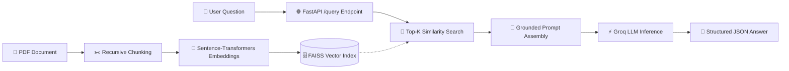

# 🚀 DocuFlow: Containerized Document RAG REST API

[](https://www.python.org/)
[](https://fastapi.tiangolo.com/)
[](https://www.docker.com/)
[](https://www.langchain.com/)
[](https://groq.com/)

**DocuFlow** is a production-ready, lightweight Retrieval-Augmented Generation (RAG) REST API that allows users to ask questions grounded directly in specific PDF documentation. By extracting, vectorizing, and semantically searching relevant context, it provides accurate, hallucination-free answers in milliseconds.

---

## 📸 Screenshots & Demos

| Docker Desktop Container Status | FastAPI Interactive Swagger UI |
| :---: | :---: |
|  |  |

| Postman / Browser Query Result |
| :---: |
|  |

---

## 🌟 Key Features

* **📄 Intelligent Document Ingestion**: Ingests unstructured PDFs using PyPDF and segments text using LangChain's `RecursiveCharacterTextSplitter` (chunk size: 500, overlap: 50).
* **🔍 Semantic Vector Search**: Embeds chunks using Hugging Face's `sentence-transformers/all-MiniLM-L6-v2` and indexes them into a CPU-optimized **FAISS** vector store.
* **⚡ Blazing-Fast Groq Inference**: Routes top-$k$ retrieved context to Groq's high-speed LPU inference engine for near-instant responses.
* **🛡️ Hallucination Guardrails**: Implements strict contextual prompt boundaries (*"Use only the provided context; if absent, return 'I don't know'"*).
* **🌐 Production-Ready FastAPI**: Exposes clean, typed REST endpoints with automatic OpenAPI / Swagger documentation (`/docs`).
* **📦 Optimized Docker Image**: Built on `python:3.12-slim` with explicit CPU-only PyTorch wheels, cutting download size by >90% and avoiding CUDA bloat.

---

## 🏗️ Architecture Flow



---

## 📁 Repository Structure

```text
├── Docker/
│   └── dockerfile            # Optimized production Dockerfile (CPU PyTorch)
├── Project Images/           # Demonstration screenshots
├── app/
│   ├── api/
│   │   └── main.py           # FastAPI entrypoint & routes (/, /query)
│   ├── core/
│   │   └── config.py         # Global settings, paths & model configurations
│   ├── rag/
│   │   ├── chunker.py        # Text splitting & chunking logic
│   │   ├── embeddings.py     # Sentence-Transformers embedding wrapper
│   │   ├── engine.py         # End-to-end RAG singleton orchestration
│   │   ├── loader.py         # PDF document parsing
│   │   └── vectorstore.py    # FAISS vector store creation & search
├── data/                     # Source PDF documents
├── .dockerignore             # Excludes venv, git, and caches from build
├── .env.example              # Environment variables template
├── .gitignore                # Protects secrets and virtual environments
└── requirements.txt          # Python dependencies
```

---

## 🚀 Getting Started

### 1. Clone the Repository

```bash
git clone https://github.com/raihan12121/RAG-Apps-using-Langchain-and-Containerizing-with-Docker.git
cd RAG-Apps-using-Langchain-and-Containerizing-with-Docker
```

### 2. Configure Environment Variables

Create your `.env` file from the template:

```bash
cp .env.example .env
```

Open `.env` and enter your free [Groq API Key](https://console.groq.com/):

```env
GROQ_API_KEY=gsk_your_actual_groq_api_key_here
```

*(Note: Do not wrap your API key in quotation marks).*

---

## 🐳 Running with Docker (Recommended)

### Build the Image

```bash
docker build -t rag-app:latest -f Docker/dockerfile .
```

### Run the Container

```bash
docker run -d -p 8000:8000 --name rag-app --env-file .env rag-app:latest
```

### Monitor Container Logs

```bash
docker logs -f rag-app
```

---

## 💻 Running Locally (Without Docker)

If you prefer to run directly on your host machine:

```bash
# 1. Create and activate a virtual environment
python -m venv myvenv

# Windows:
myvenv\Scripts\activate
# macOS/Linux:
source myvenv/bin/activate

# 2. Install dependencies
pip install -r requirements.txt

# 3. Start the FastAPI development server
uvicorn app.api.main:app --host 0.0.0.0 --port 8000 --reload
```

---

## 🔌 API Endpoints & Usage

Once running, access the server at `http://localhost:8000`:

### 1. Interactive Swagger UI
Open your browser and navigate to:
👉 **[http://localhost:8000/docs](http://localhost:8000/docs)**

### 2. Health Check (`GET /`)
```bash
curl -X GET "http://localhost:8000/"
```

**Response:**
```json
{
  "status": "online",
  "message": "RAG API with LangChain & Groq is up and running!",
  "docs": "/docs",
  "example_query": "/query?question=What is the main topic of this document?"
}
```

### 3. Query the Document (`GET /query`)
```bash
curl -X GET "http://localhost:8000/query?question=What%20is%20ethics%3F"
```

**Response:**
```json
{
  "question": "What is ethics?",
  "answer": "Ethics are the set of rules or standards that are established by society, a profession, or institution..."
}
```

---

## 📮 Testing with Postman

1. Open **Postman** and create a new `GET` request.
2. Enter the URL:
   ```text
   http://localhost:8000/query
   ```
3. Under the **Params** tab, add:
   * **Key**: `question`
   * **Value**: `What is ethics?` *(or any question based on your PDF)*
4. Click **Send** to view the response.

---

## 🛠️ Tech Stack & Libraries

* **Framework**: [FastAPI](https://fastapi.tiangolo.com/), [Uvicorn](https://www.uvicorn.org/)
* **Orchestration**: [LangChain](https://www.langchain.com/)
* **Inference**: [Groq Cloud](https://groq.com/)
* **Embeddings**: [Hugging Face Sentence-Transformers](https://huggingface.co/sentence-transformers)
* **Vector Store**: [FAISS](https://github.com/facebookresearch/faiss)
* **Document Extraction**: [pypdf](https://pypi.org/project/pypdf/)
* **Containerization**: [Docker](https://www.docker.com/)

---

## 📄 License

This project is licensed under the MIT License - see the [LICENSE](LICENSE) file for details.
